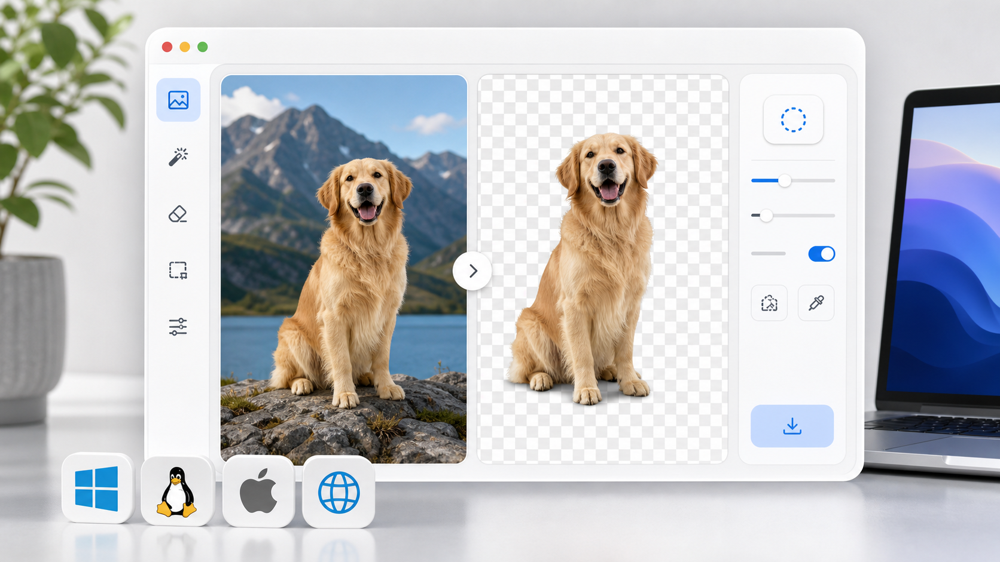

# Background Remover



A small local utility for removing image backgrounds and exporting transparent PNGs. It runs as a lightweight Flask app and uses `rembg` with ONNX Runtime for the actual segmentation work.

## Features

- Local browser UI for before/after previews
- Alpha matting for softer edges
- Mask-only export mode
- Disk-backed previews and direct PNG downloads
- Recent job metadata through `/api/jobs`
- Health and identity endpoints for local service checks
- Cross-platform Python install path for Linux, macOS, and Windows

## Quick Start

The fastest path is the bootstrap script. It creates a local virtual environment, upgrades packaging tools, and installs the Python dependencies.

Linux and macOS:

```bash
python3 scripts/bootstrap.py
. .venv/bin/activate
background-remover
```

Windows PowerShell:

```powershell
py scripts/bootstrap.py
.venv\Scripts\Activate.ps1
background-remover
```

Open `http://localhost:5050` in your browser.

## Manual Install

```bash
python3 -m venv .venv
. .venv/bin/activate
python -m pip install --upgrade pip setuptools wheel
python -m pip install -e .
background-remover
```

Windows PowerShell:

```powershell
py -m venv .venv
.venv\Scripts\Activate.ps1
python -m pip install --upgrade pip setuptools wheel
python -m pip install -e .
background-remover
```

## Runtime Dependencies

The Python package installs:

- `Flask`
- `Pillow`
- `rembg`
- `onnxruntime`

`rembg` fetches model assets on first use. The default model is `u2net`; override it with `BACKGROUND_REMOVER_MODEL` if you want to use another model supported by `rembg`.

See [docs/DEPENDENCIES.md](docs/DEPENDENCIES.md) for platform notes and troubleshooting.

## Configuration

Environment variables:

- `HOST`: bind host, defaults to `127.0.0.1`
- `PORT`: bind port, defaults to `5050`
- `BACKGROUND_REMOVER_MODEL`: rembg model name, defaults to `u2net`

Example:

```bash
HOST=127.0.0.1 PORT=7860 background-remover
```

Windows PowerShell:

```powershell
$env:HOST = "127.0.0.1"
$env:PORT = "7860"
background-remover
```

## Verify

```bash
python scripts/preflight.py
python -m unittest discover -s tests -v
```

## Project Status

This is intentionally small: one loopback-only local web app by default, local filesystem outputs, and no hosted service dependency. The main platform-sensitive dependency is `onnxruntime`, which must provide a wheel for the target OS and CPU architecture.

## License

MIT License. See [LICENSE](LICENSE).
